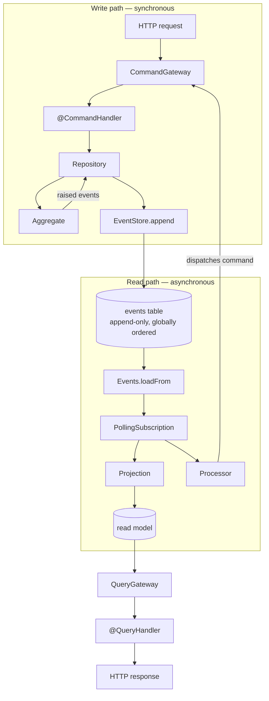
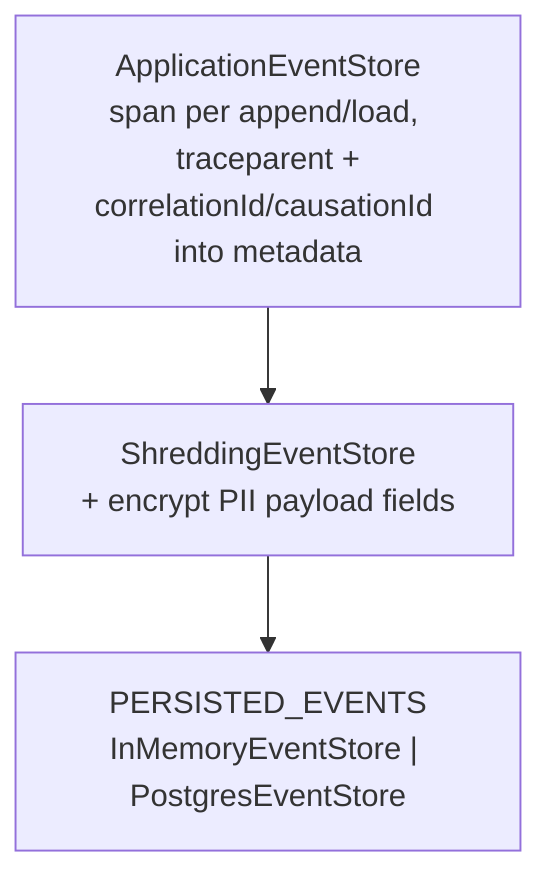
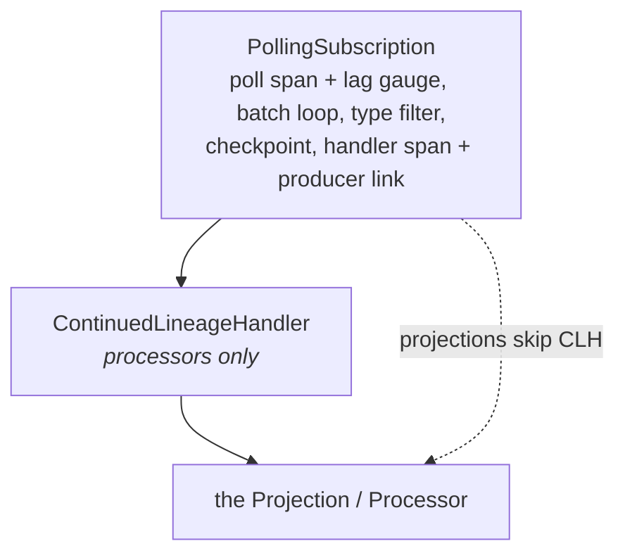

# Event Store Architecture

How the event store, its ports, subscriptions, projections and observability fit
together. Descriptive, not aspirational. Rationale lives in [`adr/`](adr/);
remaining o11y work in [`O11Y-PLAN.md`](O11Y-PLAN.md); open questions in the
root [`NEXT_BEHAVIOURS.md`](../NEXT_BEHAVIOURS.md) (rationale:
[`archive/DEFERRED.md`](archive/DEFERRED.md)).

- **`packages/event-sourcing`** — the mechanism. Nest-free; OTel is its opinion
  (the `@opentelemetry/api` facade is no-op safe without an SDK, so the package
  instruments itself and stays inert in tests).
- **`packages/market-days`** — the domain. Aggregates, projections, read models.
- **`apps/api`** — the composition root. Nest wiring, gateway tracing, profile
  selection, and the OTel SDK bootstrap that makes the package's spans real.

The split at every layer: plain classes in the package, Nest lifecycle and DI in
the app. Seams exist only where composition actually varies (ADR 0044).

---

## 1. The shape



The only coupling between the halves is the log. Nothing pushes; subscriptions
pull. At-least-once delivery falls out of the checkpoint protocol (ADR 0015).

---

## 2. Ports vs contracts

`abstract class` here is a dependency-injection decision, not inheritance: an
interface is erased at runtime and cannot be a Nest injection token.

| Kind | Declared as | Examples |
|---|---|---|
| **Port** — injected under this token | `abstract class` | `EventStore`, `Events`, `Checkpoint`, `DataKeys`, `UnitOfWork`, `CommandGateway`, `QueryGateway`, `Subscription`, `*ViewStore`, `*Views` |
| **Contract** — a shape implementations satisfy, never injected | `interface` | `EventHandler`, `Projection`, `Processor`, `Queryable` |

Composition comes in three named forms: **seams where composition varies** (the
leaf store behind `PERSISTED_EVENTS`, the shredder as a separate object for its
isolated crypto tests, `ContinuedLineageHandler` applied per handler kind —
unconditional concerns like tracing and lineage stamping are inlined instead,
ADR 0044), **template method** (a base with exactly one hole: `Aggregate.apply`,
`ProjectionFor.handlers`, `VendorScopedRepository`), and **runtime metadata**
(a `WeakMap` keyed by constructor: `@CheckpointedProjection` /
`@CheckpointedProcessor`).

---

## 3. Write path

### 3.1 Aggregate

```ts
abstract class Aggregate {
  abstract apply(event: DomainEvent): void;   // the one hole
  rehydrate(events: StoredEvent[]): this
  protected raise(event: DomainEvent): void   // apply + record
  raisedEvents(): DomainEvent[]
  currentStreamPosition(): number             // doubles as the expected version
}
```

`currentStreamPosition()` is captured at rehydration and passed to `append` as
`expectedStreamPosition`. That is the whole of optimistic concurrency: a moved
stream makes the append throw `ConcurrencyError`.

### 3.2 Repositories

`VendorScopedEvents` is the thin waist over `EventStore`. It owns the two
policies every aggregate shares: skip the append when nothing was raised, and
always stamp `{ vendorId }` into metadata — which feeds shredding's subject
lookup, `vendorIdFrom(event)` in projections, and the `vendor.id` span attribute.

`VendorScopedRepository<A>` is a template over it: subclasses (`Vendors`,
`Catalogues`, `Calendars`, `Storefronts`) supply a stream-id prefix and a
factory. `MarketDays` composes `VendorScopedEvents` directly instead — its
stream id needs `date + vendor + market`.

### 3.3 The composed event store

Two ports, deliberately separate; every layer implements both
(`EventStore & Events`) so it is transparent to the write path and the catch-up
path alike:

```ts
EventStore  →  append(streamId, events, expectedStreamPosition, metadata) / load(streamId)
Events      →  loadFrom(globalPosition, limit) / head()
```



`ApplicationEventStore` owns the cross-cutting stamps inline — tracing and
lineage were once separate decorators, but their optionality was never
compositional: no SDK → no-op tracer, no dispatch → no ids (ADR 0044). The two
seams that remain vary in fact: **shredding** stays a separate object so its
crypto edge cases (AAD versions, tamper detection, key-miss degradation) test in
isolation, and encrypts closest to persistence so plaintext never reaches the
leaf; the **leaf** is the profile seam. Only `append` and `load` are
meaningfully instrumented; `loadFrom`/`head` pass through untouched ([§10.5](#105-gaps)).

One instance under both tokens:
`{ provide: EventStore, useFactory } · { provide: Events, useExisting: EventStore }`.

### 3.4 Appending

`PostgresEventStore.append` runs a `SerializedAppend` through
`unitOfWork.inTransaction(...)` — joining the ambient transaction when one
exists, owning a fresh BEGIN … tag-verified COMMIT when none does (ADR 0034/0035):

1. `SELECT pg_advisory_xact_lock(4827193)` — one global lock so
   `global_position` commits in order (ADR 0028; rollbacks burn identity values,
   so positions are not gap-free)
2. count the stream vs `expectedStreamPosition`; mismatch → `ConcurrencyError`
3. one multi-row `INSERT` for the batch (ADR 0034)

Serialised appends are a deliberate throughput ceiling bought for monotonic
commit order — what makes the checkpoint a single bigint.

---

## 4. The log

```ts
type StoredEvent = DomainEvent & {
  id: string;
  globalPosition: number;   // log-wide order — what checkpoints track
  streamId: string;
  streamPosition: number;   // per-stream order — what concurrency checks track
  timestamp: number;
  metadata?: Record<string, unknown>;
};
```

Metadata accumulates as the append descends the chain (ADR 0014: payload is
domain fact, metadata is plumbing; optional on rehydration, so replay tolerates
its absence):

| Key | Written by | Used by |
|---|---|---|
| `vendorId` | `VendorScopedEvents` | shredding subject, `vendorIdFrom`, `vendor.id` attribute |
| `correlationId` / `causationId` | `ApplicationEventStore` | `ContinuedLineageHandler`, dispatch spans |
| `traceparent` | `ApplicationEventStore` | handler span link (`PollingSubscription`) |

---

## 5. Read models

Each read model has two ports (ADR 0016), one adapter implementing both:
`*.store.ts` is the write surface (projection-only; `clear()` lives here to
serve rebuild), the plural `*s.ts` is the read surface (query-only). Three
projection-backed models: `vendor-storefront-view`, `catalogue-view`,
`market-schedule-view`.

Three things look like projections and aren't:

- **`upcoming-market-days`** — computed from `MarketScheduleViews` at query time; no store.
- **`customer-storefront`** — `FindCustomerStorefrontHandler` composes registry,
  views and the upcoming-market-days handler per request; the composition is the view.
- **`SubdomainRegistry`** — written by command handlers, **not derivable from the
  log**, never rebuildable — which is why `VendorErasure` deletes from it explicitly.

---

## 6. Handlers

`EventHandler` (`handle`, `eventTypes`) is the base contract; `Projection` adds
`reset()`; `Processor` is an alias. `ProjectionFor<E>` is the template all three
projections extend:

```ts
type EventHandlerMap<T extends DomainEvent> =
  Record<T['type'], (event: StoredEvent) => Promise<void>>;
```

`E` is the domain's discriminated union, so the `Record` demands exactly one key
per member: adding an event to the union is a compile error in every projection
over it until handled. `eventTypes()` is derived from `Object.keys()` of the
same map, so the subscription's filter cannot drift from the dispatch table.
`handle()` indexes the map with a cast — safe only because
`PollingSubscription` filters on `eventTypes()` first. That is a
**collaboration invariant**: any handler wrapper (`ContinuedLineageHandler` is
the one that exists) must forward `eventTypes()` faithfully, not just `handle()`.

Consumer kind is runtime metadata, not type: `@CheckpointedProjection('name')` /
`@CheckpointedProcessor('name')` populate a `WeakMap`. The checkpoint name is
the durable resume key — rename it and you replay from zero. A custom ESLint
rule enforces the decorator⇄hierarchy correspondence both ways (known limits: it
matches identifiers in `extends`/`implements`, so intermediate bases false-positive
and aliased imports defeat it).

---

## 7. Subscriptions

`Subscriptions` (`apps/api/.../subscriptions.ts`) is the runner. Discovery
walks `DiscoveryService.getProviders()`, keeps checkpoint-decorated instances,
rejects duplicate names at bootstrap.

### 7.1 The per-consumer stack



`PollingSubscription` owns both spans of the cycle — the suppressed poll span
and the per-event handler span that lifts the suppression — so the pairing that
was once a cross-class collaboration is two visible lines in one file
(ADR 0044). `ContinuedLineageHandler` stays a wrapper because it is the one
genuinely conditional layer, chosen per handler kind at discovery time.

### 7.2 The poll cycle

`poll()` loops while batches are full (100): read checkpoint → `loadFrom` →
for each event, inside one `unitOfWork.transaction`: handle (if the type
matches) then `checkpoint.advance(from, to)`. Handle and advance commit
**atomically** — a throw rolls both back, so a poison event replays rather than
being skipped (per-event dead-lettering is deferred).

The advance is **compare-and-set** (ADR 0036): a mismatch throws
`CheckpointConflictError`, aborting the transaction, effects and all. The
checkpoint is a fencing token — a stale writer (deploy overlap, poll in flight
across a rebuild reset) can neither land effects nor move the position. A
conflict is a yield, not a failure: the retry re-reads and continues.

For a **processor** the unit is wider than it looks: its dispatched command's
appends join the ambient transaction (ADR 0035), so command effects and the
checkpoint commit together. Exactly-once holds for side effects that are writes
to this database; anything leaving it is at-least-once and must tolerate
redelivery (ADR 0036 records the idempotency-key rule for the first one — none
exists yet).

### 7.3 Schedule and failure

```ts
PollSchedule.pokedWithBackstop(pokes, backstopMs)           // 300_000 ms default; 1_000 in dev
  .pokes()
  .pipe(exhaustMap(() => subscription.poll()),              // polls never overlap
        retry({ resetOnSuccess: true, delay: exponential capped at 30_000 }))
```

The notification stream (LISTEN/NOTIFY in Postgres, a `Subject` poked on append
in memory) is the actual drive; the timer is a backstop for a poke discarded
mid-poll by `exhaustMap`. Retries are infinite by design; a
`CheckpointConflictError` logs quietly, everything else as an error.

### 7.4 Rebuild

`rebuild(name)` refuses processors (replay re-runs side effects), then
atomically `projection.reset()` + `checkpoint.reset()` in one transaction, then
polls. The poller stays running: the CAS advance fences out any in-flight poll.
`reset()` is `abstract` on `ProjectionFor` — a store-backed projection must
state what a rebuild clears (all three: `store.clear()`), because a replay onto
an uncleared model can never remove rows the log no longer produces. Each
rebuild path is pinned by an integration spec seeding an **orphan row with no
backing events** — the one assertion a no-op `reset()` cannot pass — plus a
replay-fidelity case.

`drain()` (tests only) runs N polling rounds, N = consumer count, so a
processor's events reach downstream projections within one call.

---

## 8. Profiles

`AppModule` picks one `@Global()` persistence module; everything downstream asks
for the port and never learns which answered. `EventSourcingModule.forRoot(piiFields)`
is profile-agnostic — it wraps whatever `PERSISTED_EVENTS` answered.

| Token | In-memory | Postgres |
|---|---|---|
| `PERSISTED_EVENTS` | `InMemoryEventStore` | `PostgresEventStore` |
| `DataKeys` | `InMemoryDataKeys` | `PostgresDataKeys` + `MasterKeyring` |
| `UnitOfWork` | `UnitOfWork.none()` | `PostgresUnitOfWork` |
| `PollSchedule` | pokes on append, 1s backstop | LISTEN/NOTIFY pokes, 5min backstop |
| `CHECKPOINT_FACTORY` | (absent → `InMemoryCheckpoint`) | `PostgresCheckpoint` |

### `InMemoryEventStore`

One log array is the sole source of ordering; positions are assigned at
insertion, so `seedWith` and `append` can interleave without `loadFrom`/`head`
ever disagreeing (ADR 0038 — the old two-array design let the fake be *looser*
than Postgres). `newEvents()`/`lastEvent()` are assertion views over appended
events, never a source of ordering.

### `PostgresUnitOfWork` — the transactional seam

Simultaneously the transaction boundary and the query router:

- `transaction(fn)` — delegates to `inTransaction`: a **nested `transaction()`
  joins the ambient transaction** rather than opening an independent one
  (ADR 0037); the owner's COMMIT alone decides durability, and its command tag
  is verified — Postgres resolves COMMIT on an aborted transaction as ROLLBACK
  (ADR 0034).
- `inTransaction(work)` — run multi-statement work on the ambient client, else
  own a fresh transaction. The append path's seam (ADR 0035).
- `query(text, params)` — routes to the ambient client, else the pool.

The pg view adapters take the UoW *as their `Queryable`* — not the raw `Pool` —
so a projection write and its checkpoint write share one physical transaction
with no adapter knowing it. (`Pool` satisfies `Queryable` too, so tests can pass
a raw pool.)

`PostgresDataKeys` deliberately bypasses the UoW and takes the raw `Pool`: a
minted key must survive even if the surrounding append rolls back, and `shred()`
is its own commit.

### LISTEN/NOTIFY

`PostgresNotifications` (package, framework-free) is one long-lived `LISTEN
events` connection exposed as a poke stream plus a `status()` stream
(`connected` / `dropped` / `reconnected`). Per ADR 0042: instances are
**single-use** (one `start()`, one `stop()`; restart = new instance), `start()`
**rejects** if the first connection fails — a misconfigured LISTEN fails the
deploy instead of surfacing as read-model lag — and each connection is reified
as a `ListeningConnection` whose `lost` promise settles exactly once, so pg's
double-firing failure events need no debounce. Losses after a successful start
reconnect with capped exponential backoff and poke once on reconnect to cover
the gap. `TracingPostgresNotifications` (app) wraps it with lifecycle wiring and
`pg-listen <state>` marker spans.

---

## 9. Lineage and erasure

### 9.1 Lineage

`Lineage` is an `AsyncLocalStorage` wrapper; domain code never sees it. It is
deliberately **not** OTel context: lineage is durable provenance written into
the log, total and unconditional, where traces are sampled, retention-bound and
absent without an SDK — and the consumer side deliberately breaks the trace
(new root per handled event) exactly where lineage must survive (ADR 0044).
`LineageMiddleware` mints `correlationId = causationId = uuid` per dispatch;
`ApplicationEventStore` stamps the ambient ids into append metadata;
`ContinuedLineageHandler` wraps **processors only** (projections dispatch
nothing), setting `correlationId` from the consumed event's metadata and
`causationId = event.id` — so a processor's dispatched commands append with the
originating request's correlation id.

### 9.2 Crypto-shredding erasure

PII payload fields are encrypted per-vendor (AES-256-GCM) by
`ShreddingEventStore`; deleting the vendor's data key makes them unreadable
(ADR 0025 — the log itself is never touched).

**Value envelope** — `enc:v2:iv:tag:ciphertext`. The version names the AAD that
sealed the value (ADR 0041): v1 bound (streamId, type, field) NUL-separated —
two same-type events in one stream had interchangeable ciphertexts; v2 adds the
**stream position** and length-prefixes each component, so a ciphertext moved to
any other event fails authentication. Encrypt always writes v2; decrypt
dispatches on the prefix — v1 values are decodable forever since the log never
rewrites. The position for a batch is `expectedStreamPosition + i + 1`, bound
before the row exists; a concurrency rejection persists nothing, so it cannot
go stale.

**Writes strict, reads total** (ADR 0039). Encrypt: `null`/`undefined` PII
fields pass through untouched; any other non-string throws; a PII-bearing event
with no `vendorId` in metadata throws. Decrypt: an event whose subject is
unresolvable or whose key is gone degrades to the `SHREDDED` sentinel instead of
throwing — the log is append-only, so a throw on read would be a permanent
poison pill for the stream and every catch-up. The sentinel is a string, not
null, so read-model columns stay `NOT NULL`.

**Key envelope** (ADR 0040). Data keys are stored wrapped
(`iv ‖ authTag ‖ ciphertext`, subject id as AAD) under a master key from a
versioned `MasterKeyring`; `data_keys.key_version` names the wrapping version.
Wrapping uses the ring's current version; unwrapping selects by the row's; a row
read under an old version is lazily re-wrapped (compare-and-set on
`key_version`, so a racing shred's DELETE wins — an erased key is never
resurrected). Rotation is config: add a key, flip `MASTER_KEY_CURRENT`, deploy;
retire a version once no row references it. Config shapes: `MASTER_KEY=<base64>`
(single, version 1) or `MASTER_KEYS="1:<b64>;2:<b64>"` + `MASTER_KEY_CURRENT`.
On Render they live in a Secret File read off disk, never `process.env`. The
ring validates at boot.

**Erasure** = `DataKeys.shred(vendorId)` → `rebuild('vendor-storefront-view')`
(decrypt-on-load means projections cache plaintext, so the rebuild — replaying
into `SHREDDED` — *is* the erasure) → `SubdomainRegistry.removeFor(vendorId)`
(not event-derived, deleted explicitly).

---

## 10. Observability

ADR 0026: a span is a wide event — fat spans, not many thin logs. Domain
packages carry no OTel; every annotation lives in `apps/api/.../tracing/`.

### 10.1 Bootstrap

`apps/api/src/tracing.ts` is the first import of `main.ts`, so `NodeSDK` can
patch `@nestjs`, `express`, `http`, `pg`. Exporter: `OTLPTraceExporter`
(protobuf) via `OTEL_EXPORTER_OTLP_*`. `RENDER_GIT_COMMIT` stamps
`service.version`. `SIGTERM`/`SIGINT` flush via `sdk.shutdown()`.

### 10.2 Span inventory

| Span | Created by | Kind | Attributes |
|---|---|---|---|
| `<CommandName>` | `TracingCommandGateway` | child of request | `command.name`, `app.correlation_id`, `app.causation_id` |
| `<QueryName>` | `TracingQueryGateway` | child of request | `query.name` |
| `event-store append` | `ApplicationEventStore` | child of dispatch | `event.type`, `event.count`, `stream_id`, `vendor.id` |
| `event-store load` | `ApplicationEventStore` | active | `stream_id`, `event.count` |
| `subscription poll` | `PollingSubscription` | **root** | `subscription.name`, `subscription.lag` |
| `event-handler handle` | `PollingSubscription` | **root + link to producer** | `event.type`, `processing.lag_ms`, `vendor.id`, `app.correlation_id`, `app.causation_id` |
| `pg-listen <state>` | `TracingPostgresNotifications` | marker | `listen.state`, `reconnect.attempt`, `error.message` |

Everything else comes from auto-instrumentation. Failure enrichment is one
protocol, centralised in `withSpan(span, slug, work)`: on throw set
`exception.slug`, record the exception, set ERROR, rethrow; always `end()`. Six
slugs: `command-dispatch-failed`, `query-dispatch-failed`,
`event-store-append-failed`, `event-store-load-failed`, `event-handler-failed`,
`subscription-poll-failed`. Spans are payload-blind — `command.name`, never
command contents — pinned by an exact-match attribute assertion in
`tracing/command-gateway.spec.ts`.

### 10.3 Trace continuity across the commit boundary

The write path is one trace. `ApplicationEventStore` serialises its own span
context as `00-<traceId>-<spanId>-<flags>` into metadata — skipped when the
context is invalid (no SDK registered → no-op tracer → all-zero ids), so a
garbage traceparent never reaches the log. `PollingSubscription` starts a
**new root** trace per consumed event with a *link* back (strict-regex parse;
malformed/absent/all-zero → no link, so replay never resurrects a dead trace). Links, not
parents, keep traces bounded under processor→command fan-out.
`processing.lag_ms` = handle-time − commit-time — the read-model freshness SLO
(ADR 0026).

### 10.4 The suppression dance

Idle polls' auto-instrumented pg/dns/tcp spans outnumbered real spans ~1000:1.
`PollingSubscription.poll()` runs the whole poll under `suppressTracing` and
lifts the suppression exactly when an event is actually handled — both halves
of the pairing live in that one class. Detail is dropped when nothing
happened, restored when there is work.
The lag gauge (`head() − checkpoint.read()`) is read before the poll — `poll()`
drains, so after would always gauge zero; a gauge failure sets
`subscription.lag_unavailable` rather than failing the poll.

### 10.5 Gaps

1. **`admin-api` has no tracing at all** — no bootstrap, no spans, yet it writes
   `SubdomainRegistry` and creates Auth0 users. Largest gap by surface area.
2. **The projection⇄checkpoint transaction is invisible**: only the inner
   `handle` un-suppresses; `BEGIN`/`COMMIT`/checkpoint `UPDATE` produce no spans.
3. **`loadFrom`/`head` are unspanned** and suppressed — the most-executed store
   operations are opaque. Deliberate (§10.4's trade), but real.
4. **`Subscriptions.rebuild()` emits no span** — the most impactful operation
   (and the GDPR-erasure path) leaves no trace of what/how long/how many events.
5. **`VendorErasure.erase()` emits no span** tying shred → rebuild → subdomain
   removal together on a compliance-critical path.
6. **`exception.slug` values are unenforced convention** — string literals at
   call sites; a typo'd seventh slug would silently escape Honeycomb queries.
7. **No metrics pipeline** — traces only; every SLO is a query over span
   attributes.
8. **No sampling** — `ParentBased(AlwaysOn)`; 100% export. Fine at current
   volume; a cost cliff later.

Tracked separately in [`O11Y-PLAN.md`](O11Y-PLAN.md): payload attribute
extractors, stuck-subscription alerting, Collector/tail-sampling.

### 10.6 Testing spans

`apps/api/src/app/testing/span-capture.ts` registers a hermetic test-only
provider + `InMemorySpanExporter`, no auto-instrumentation, so
`getFinishedSpans()` contains only application spans.

---

## 11. Testing strategy

- **Contract suites** (`test/src/**/*.contract.ts`) — one suite run against both
  the in-memory and Postgres adapters, so the fake and the real thing cannot
  drift: `eventStoreContract` (also instantiated over the `ApplicationEventStore`
  and `ShreddingEventStore` compositions), `eventsContract`,
  `checkpointContract`, `subscriptionContract` (includes a >1-batch backlog
  drain case), `dataKeysContract`, plus the three read-model contracts.
- **Container specs** (`*.container.spec.ts`) — real Postgres via
  testcontainers, separate vitest config (`test:container`), excluded from the
  fast suite.
- **API specs** (`apps/api/**/*.spec.ts`) — full Nest app over supertest on the
  in-memory profile, `PollSchedule.never()`, `Subscriptions.drain()` driving
  delivery deterministically.
- **Mutation testing** — nightly Stryker over the fast suite
  (`stryker.conf.mjs`, `.github/workflows/mutation.yml`), informational (no
  break threshold). Scope is honest by design: container-only Postgres adapters
  are excluded so the score means "how well does the fast suite own the code it
  claims"; coverage reports `all: true` so wholly-untested files show as 0%
  instead of vanishing.

---

## 12. File map

| Concern | Path |
|---|---|
| Ports | `packages/event-sourcing/src/ports/` |
| Domain primitives | `packages/event-sourcing/src/domain/` |
| Adapters | `packages/event-sourcing/src/adapters/{in-memory,postgres}/` |
| Cross-cutting stores | `packages/event-sourcing/src/adapters/{application,shredding}.event-store.ts` |
| Master keyring | `packages/event-sourcing/src/adapters/postgres/master-keyring.ts` + `apps/api/.../event-sourcing/master-keyring.ts` (config parsing) |
| Aggregates + repositories | `packages/market-days/src/<aggregate>/` |
| Projections + read models | `packages/market-days/src/<name>-view/` |
| Composition root | `apps/api/src/app/app.module.ts` |
| Profiles | `apps/api/src/app/persistence/` |
| Subscription runner | `apps/api/src/app/event-sourcing/subscriptions.ts` |
| Gateway tracing + LISTEN lifecycle | `apps/api/src/app/event-sourcing/tracing/` |
| OTel bootstrap | `apps/api/src/tracing.ts` |

### Related ADRs

0002 (event sourcing + CQRS) · 0005 (single events table) · 0009
(stream-per-aggregate) · 0010 (repositories) · 0014 (payload vs metadata) ·
0015 (polling subscriptions, amended) · 0016 (read-model port segregation) ·
0025 (crypto-shredding) · 0026 (observability) · 0028 (serialised appends) ·
0029 (Postgres adapters) · 0030 (LISTEN/NOTIFY) · 0034 (atomic appends,
verified commit) · 0035 (appends join the ambient unit of work) · 0036
(compare-and-set checkpoints) · 0037 (nested transactions join) · 0038
(in-memory single log) · 0039 (shredding reads degrade, writes strict) · 0040
(master keyring, lazy re-wrap) · 0041 (AAD v2 binds stream position) · 0042
(LISTEN lifecycle)
