# Event Store Architecture

How the event store, its ports, subscriptions, projections and observability fit
together. Descriptive, not aspirational: everything below is in the code today.
Decisions and their rationale live in [`adr/`](adr/); remaining o11y work in
[`O11Y-PLAN.md`](O11Y-PLAN.md); open questions in [`DEFERRED.md`](DEFERRED.md).

- **`packages/event-sourcing`** — the mechanism. Framework-free: no Nest, no OTel.
- **`packages/market-days`** — the domain. Aggregates, projections, read models.
- **`apps/api`** — the composition root. Nest wiring, tracing, profile selection.

That split is load-bearing and recurs at every layer: a plain class in the package,
a decorator in the app that adds framework lifecycle and instrumentation around it.

---

## 1. The shape

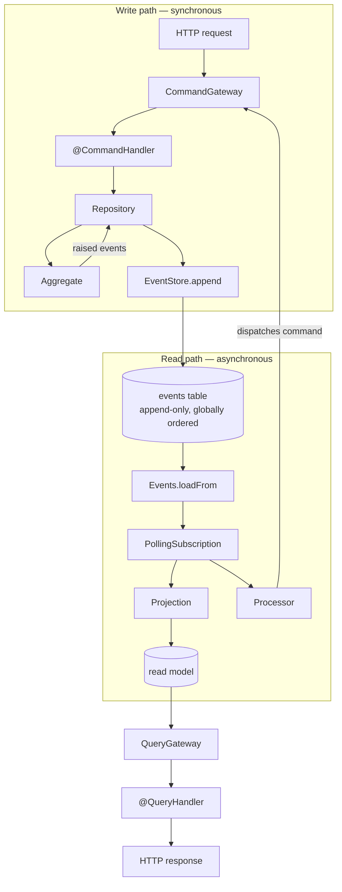

The only coupling between the two halves is the log. Nothing pushes; subscriptions
pull. At-least-once delivery falls out of the checkpoint protocol (ADR 0015).

---

## 2. Two kinds of abstraction, and how to tell them apart

This codebase uses `abstract class` where most TypeScript uses `interface`. That is
**not** an inheritance decision — it is a dependency-injection decision. An interface
is erased at runtime and cannot be a Nest injection token; an abstract class survives
as a value you can write `inject: [EventStore]` against.

The rule:

| Kind | Declared as | Why | Examples |
|---|---|---|---|
| **Port** — something gets injected under this token | `abstract class` | must exist at runtime | `EventStore`, `Events`, `Checkpoint`, `DataKeys`, `UnitOfWork`, `CommandGateway`, `QueryGateway`, `Subscription`, `*ViewStore`, `*Views` |
| **Contract** — a shape implementations satisfy | `interface` | never injected, never `instanceof` | `EventHandler`, `Projection`, `Processor`, `Queryable` |

`Projection` earned its way into the second row the hard way. As an abstract class it
could carry a concrete default `reset()`, and two of three projections silently
inherited it — see [§7.5](#75-rebuild) and the amendment to ADR 0015.

Composition, meanwhile, comes in three forms, and it helps to name which is which:

- **Decorator chains** — same port, wrapped repeatedly, each layer adding one concern
  (the event store, the subscription, the event handler).
- **Template method** — a base owning mechanics with exactly one hole
  (`Aggregate.apply`, `ProjectionFor.handlers`, `VendorScopedRepository`).
- **Runtime metadata** — facts the type system cannot carry, kept in a `WeakMap`
  keyed by constructor (`@CheckpointedProjection` / `@CheckpointedProcessor`).

---

## 3. Write path

### 3.1 Aggregate

```ts
abstract class Aggregate {
  abstract apply(event: DomainEvent): void;   // the one hole
  rehydrate(events: StoredEvent[]): this      // replay, remembering stream position
  protected raise(event: DomainEvent): void   // apply + record
  raisedEvents(): DomainEvent[]
  currentStreamPosition(): number             // doubles as the expected version
}
```

`currentStreamPosition()` is captured at rehydration and passed to `append` as
`expectedStreamPosition`. That is the whole of optimistic concurrency: if another
writer moved the stream in between, the append throws `ConcurrencyError`.

### 3.2 Repositories

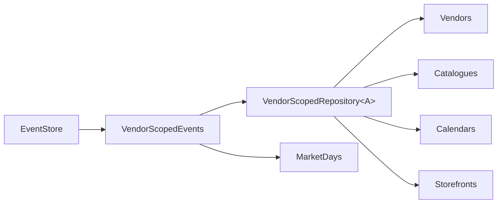

`VendorScopedEvents` is the thin waist. It owns the two policies every aggregate
shares: **skip the append when nothing was raised**, and **always stamp
`{ vendorId }` into metadata**. That second one is load-bearing far downstream — it
feeds shredding's subject lookup, `vendorIdFrom(event)` in every projection, and the
`vendor.id` span attribute.

`VendorScopedRepository` is a template: subclasses supply only a stream-id prefix and
a factory. `MarketDays` deliberately does *not* extend it — its stream id needs
`date + vendor + market`, so it composes `VendorScopedEvents` directly. Composition
where the shape doesn't fit, rather than bending the base class.

### 3.3 The event store decorator chain

Two ports, deliberately separate:

```ts
EventStore  →  append(streamId, events, expectedStreamPosition, metadata) / load(streamId)
Events      →  loadFrom(globalPosition, limit) / head()
```

Every wrapper implements **both** (`EventStore & Events`), because it must be
transparent to both the write path and the catch-up path.

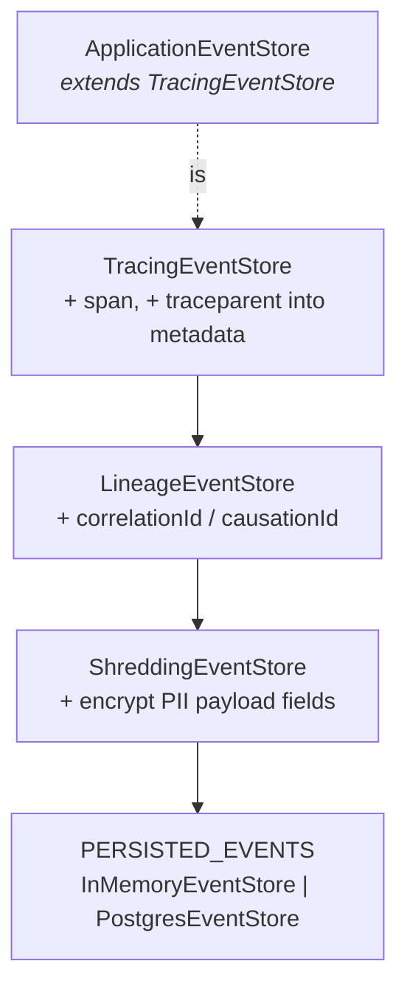

`ApplicationEventStore` **extends** the outermost decorator and **composes** the rest
in its constructor, so the composition root stays a single `new`.

Ordering is not arbitrary:

| Layer | Why here |
|---|---|
| Tracing **outermost** | it mints the span and writes `traceparent` into metadata *before* delegating, so the trace id reaches the database row and consumers can link back |
| Lineage next | stamps ambient `correlationId`/`causationId`; adds nothing when there is no ambient lineage, so it stays a faithful `EventStore` |
| Shredding **innermost** | encrypts closest to persistence, so **plaintext never reaches the leaf** |

Only `append` and `load` are meaningfully decorated. `loadFrom` and `head` pass
straight through Tracing untouched — deliberate, and a known blind spot ([§10.5](#105-gaps)).

One instance is exposed under both tokens:

```ts
{ provide: EventStore, useFactory: … }
{ provide: Events, useExisting: EventStore }
```

### 3.4 Appending

`PostgresEventStore.append` runs a `SerializedAppend` through
`unitOfWork.inTransaction(...)` — the ambient transaction when one exists, a fresh
one (BEGIN … tag-verified COMMIT, ADR 0034/0035) when none does:

1. `SELECT pg_advisory_xact_lock(4827193)` — one global lock so `global_position`
   commits in order: monotonic commit order, which is all the single-bigint cursor
   needs (ADR 0028; rollbacks burn identity values, so positions are not gap-free)
2. count the stream, compare to `expectedStreamPosition`, throw `ConcurrencyError` on
   mismatch
3. one multi-row `INSERT` for the whole batch (ADR 0034)

Serialised appends are a deliberate throughput ceiling bought in exchange for
monotonic commit order, which is what makes the checkpoint a single number.

---

## 4. The log

```ts
type StoredEvent = DomainEvent & {
  id: string;
  globalPosition: number;   // log-wide order — what checkpoints track
  streamId: string;
  streamPosition: number;   // per-stream order — what concurrency checks track
  timestamp: number;
  metadata?: Record<string, unknown>;
};
```

Metadata accumulates as the append descends the chain:

| Key | Written by | Used by |
|---|---|---|
| `vendorId` | `VendorScopedEvents` | shredding subject, `vendorIdFrom`, `vendor.id` attribute |
| `correlationId` / `causationId` | `LineageEventStore` | `ContinuedLineageHandler`, dispatch spans |
| `traceparent` | `TracingEventStore` | `TracingEventHandler` span link |

ADR 0014 governs the split: payload is domain fact, metadata is plumbing. Metadata is
optional on rehydration, so replay tolerates its absence.

---

## 5. Read models

Each read model has **two ports** (ADR 0016), and one adapter implements both:

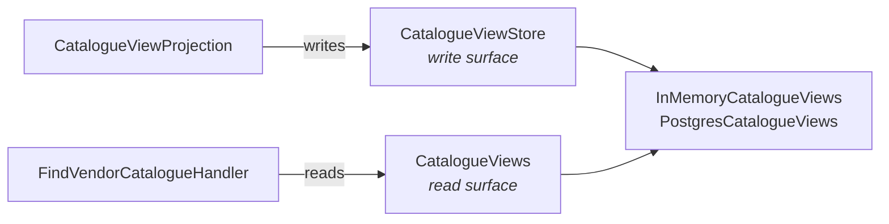

Naming convention: `*.store.ts` is the write surface; the plural `*s.ts`
(`catalogue-views.ts`) is the read surface. Query code physically cannot mutate;
projection code cannot grow query features. `clear()` lives on the write surface
because it exists to serve rebuild.

Not every durable read is a projection. Three look like one and aren't:

- **`upcoming-market-days`** has a view type and a query handler but no store — it is
  computed from `MarketScheduleViews` at query time.
- **`customer-storefront`** is the same shape one level up: `FindCustomerStorefrontHandler`
  composes `SubdomainRegistry`, `VendorStorefrontViews`, `CatalogueViews` and the
  upcoming-market-days handler into the public page per request. No store, no projection,
  nothing to rebuild — the composition is the view.
- **`SubdomainRegistry`** is written by command handlers, not fed by events. It is
  **not derivable from the log** and can never be rebuilt — which is exactly why
  `VendorErasure` deletes from it explicitly instead of relying on a replay.

---

## 6. Handlers

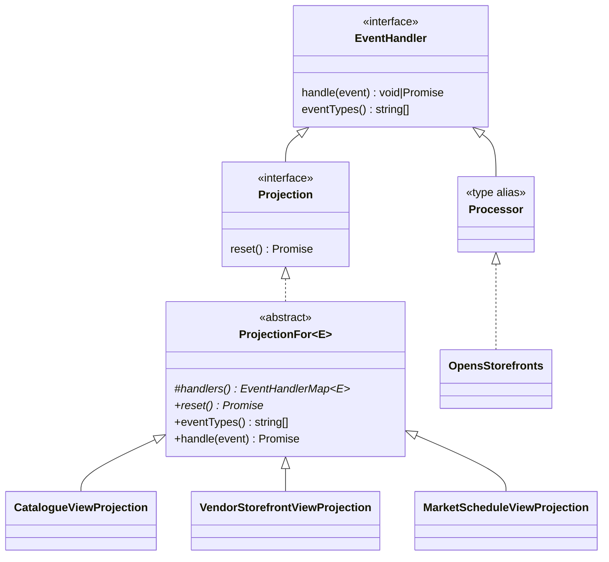

### 6.1 `ProjectionFor` and exhaustiveness

```ts
type EventHandlerMap<T extends DomainEvent> =
  Record<T['type'], (event: StoredEvent) => Promise<void>>;
```

`E` is the domain's discriminated union (`CatalogueEvent = ItemAddedToCatalogue |
ItemRetired | …`). `T['type']` distributes over it, so `Record` demands **exactly one
key per member — no fewer, no extras**. Adding an event to the union is a compile
error in every projection over it until handled. `eventTypes()` is *derived* from
`Object.keys()` of the same map, so the subscription's filter cannot drift from the
dispatch table.

`handle()` indexes the map with a cast:

```ts
return this.map()[event.type as E['type']](event);
```

That is safe only because `PollingSubscription` filters on `eventTypes()` first — a
**collaboration invariant** between two classes, not a local property. It is why every
handler decorator must forward `eventTypes()` faithfully, not just `handle()`.

### 6.2 The kind is metadata, not type

`Subscriptions` does not read the class hierarchy. It reads a `WeakMap` populated by
the decorators:

```ts
@CheckpointedProjection('catalogue-view')   // kind: 'projection', replay-safe
@CheckpointedProcessor('opens-storefronts') // kind: 'processor', NOT replay-safe
```

The checkpoint name is the **durable resume key**. Rename it and you orphan the old
checkpoint and replay from zero.

Because the hierarchy is structural (a class may `implements` rather than `extends`),
there is no reliable `instanceof`, so a **custom ESLint rule** in `eslint.config.mjs`
enforces the correspondence in both directions:

- a concrete class related to `Projection`/`ProjectionFor` **must** carry
  `@CheckpointedProjection` — otherwise it silently never runs;
- a `@CheckpointedProjection` class **must** be related to one of them.

Known limits of that rule: it matches *identifiers* in `extends`/`implements` clauses,
so an intermediate abstract base is a false positive, and an aliased import
(`import { Projection as View }`) defeats it in both directions.

---

## 7. Subscriptions

`Subscriptions` (`apps/api/.../subscriptions.ts`) is the runner.

### 7.1 Discovery

Walks `DiscoveryService.getProviders()`, keeps instances whose constructor carries
checkpoint metadata, and rejects duplicate checkpoint names at bootstrap.

### 7.2 The per-consumer stack

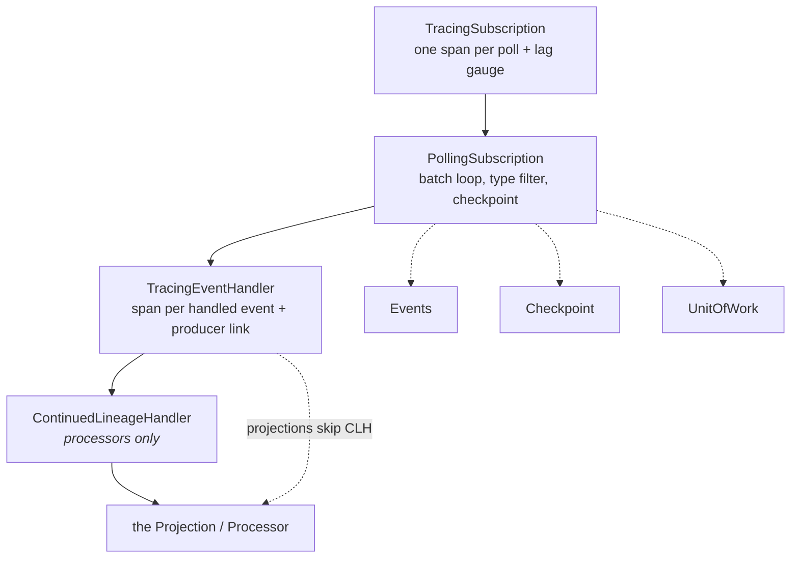

### 7.3 The poll cycle

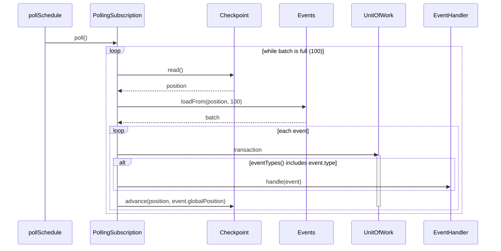

Handle and checkpoint-advance commit **atomically**. A throw rolls both back, so a
poison event replays rather than being silently skipped. Per-event dead-lettering
needs a durable attempt count and is deferred.

The advance is **compare-and-set** (ADR 0036): `advance(from, to)` names the
position this loop last saw, and a mismatch throws `CheckpointConflictError`,
aborting the transaction — handler effects and all. The checkpoint is therefore a
fencing token: a stale writer (another instance during a deploy overlap, or a poll
in flight across a rebuild's reset) can neither land effects nor move the
position. A conflict is a yield, not a failure — the retry below re-reads the
checkpoint and continues from wherever it actually is.

For a **processor** the unit is wider than it looks: its dispatched command
appends events, and `PostgresEventStore` joins the ambient transaction when one
exists (ADR 0035) — so the command's appends and the checkpoint commit together
or not at all. Exactly-once therefore holds for side effects that are writes to
this database. A processor whose side effect *leaves* the database (an email, an
external API call) is still at-least-once and must tolerate redelivery; no such
processor exists today (ADR 0036 records the idempotency-key rule for the first
one).

### 7.4 Schedule and failure

```ts
pollSchedule = merge(timer(0, intervalMs), notifications)   // 300_000 ms default; 1_000 in dev
  .pipe(exhaustMap(() => subscription.poll()),              // polls never overlap
        retry({ resetOnSuccess: true, delay: exponential capped at 30_000 }))
```

The notification stream is the actual drive — LISTEN/NOTIFY in Postgres, a `Subject`
poked on append in memory. The timer is a backstop for the narrow race where a poke
lands mid-poll and `exhaustMap` discards it. Retries are infinite by design: a
transient store outage should recover, not kill the consumer.

### 7.5 Rebuild

```ts
async rebuild(name) {
  if (kind !== 'projection') throw   // a processor re-runs its side effects
  await unitOfWork.transaction(() => { projection.reset(); checkpoint.reset() })
  await subscription.poll()
}
```

`reset()` is `abstract` on `ProjectionFor`, so a store-backed projection **must** state
what a rebuild clears. This is enforced by the compiler rather than by review, because
the previous concrete default was silently inherited twice: a replay onto an uncleared
read model can overwrite what the events re-assert but can never remove a row the log
no longer produces — and reports success either way.

All three projections implement it as `store.clear()`. Each rebuild path is pinned by
an integration spec that seeds an **orphan row with no backing events** — the one
assertion a no-op `reset()` cannot pass — plus a replay-fidelity case:

| projection | clear proven by | replay proven by |
|---|---|---|
| `vendor-storefront-view` | orphan row | pre-existing view assertions |
| `catalogue-view` | orphan row | a chosen order survives (`ItemsReordered`) |
| `market-schedule-view` | orphan row | absences replay once, not twice |

---

## 8. Profiles

`AppModule` picks exactly one `@Global()` persistence module; everything downstream
asks for the port and never learns which answered.

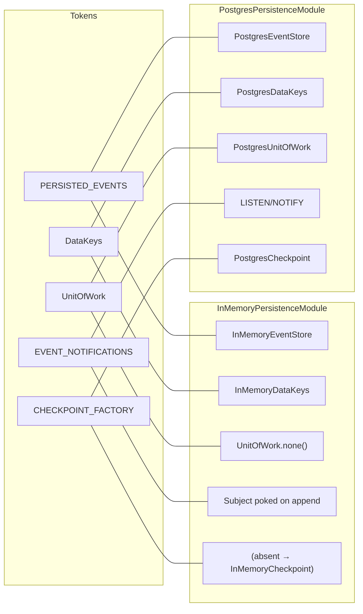

`EventSourcingModule.forRoot(piiFields)` is entirely profile-agnostic — it wraps
whatever `PERSISTED_EVENTS` answered, so the decorator chain is written once.

### `PostgresUnitOfWork` — the transactional seam

```ts
class PostgresUnitOfWork extends UnitOfWork implements Queryable {
  transaction(fn) { /* BEGIN on a pooled client stashed in AsyncLocalStorage;
                       COMMIT's command tag is verified (ADR 0034) */ }
  inTransaction(work) { /* run work(client) in the ambient transaction, else own one */ }
  query(text, params) { return (this.active.getStore() ?? this.pool).query(…) }
}
```

It is simultaneously the transaction boundary **and** the query router. Because the
Postgres view adapters are constructed with the UoW *as their `Queryable`* — not with
the raw `Pool` — a projection write and its checkpoint write land in one physical
transaction with no adapter knowing it. `Queryable` is what makes the swap invisible:
`Pool` satisfies it too, so tests can pass a raw pool.

`PostgresEventStore` needs more than query routing: an append is multi-statement
work that must pin one connection. So it *tells* the UoW —
`inTransaction(client => new SerializedAppend(client, streamId).execute(…))` — and
never learns which case applied. Inside a transaction the lock, check, and INSERT
run on the ambient client and the outer, tag-verified commit decides durability
(ADR 0035); outside one, the UoW owns a fresh transaction around the same
statements. All transaction lifecycle lives in one place, `PostgresUnitOfWork`,
which is also the only holder of the ADR 0034 verified-commit check.

`PostgresDataKeys` deliberately bypasses this and takes the raw `Pool`: a minted key
must survive even if the surrounding append rolls back, and `shred()` is its own
commit.

---

## 9. Lineage and erasure

### 9.1 Lineage

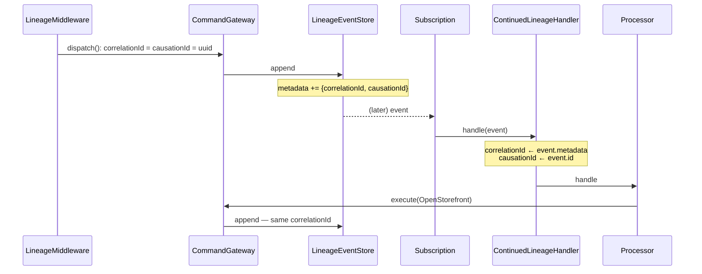

`Lineage` is an `AsyncLocalStorage` wrapper; domain code never sees it.
`ContinuedLineageHandler` wraps **processors only** — projections dispatch nothing, so
there is nothing downstream to attribute.

### 9.2 Crypto-shredding erasure

PII is encrypted per-vendor with a data key, wrapped under a master key that never
touches the database. Model A: `ShreddingEventStore` decrypts on `load` *and*
`loadFrom`, so **projections cache plaintext PII in the read model**. Deleting the key
is therefore not sufficient — the rebuild is the erasure.

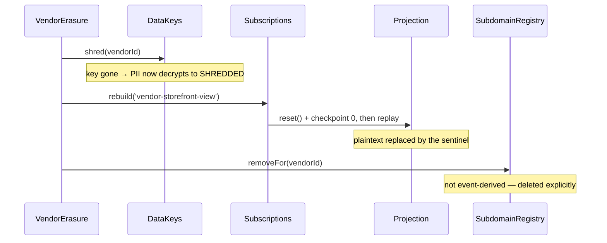

The sentinel is a string, not null, so read-model columns stay `NOT NULL` and value
objects never see null. The event log itself is untouched (ADR 0025).

---

## 10. Observability

ADR 0026: **a span is a wide event.** Fat spans, not many thin logs. Domain packages
carry no OTel dependency — every annotation lives in `apps/api/.../tracing/`.

### 10.1 Bootstrap

`apps/api/src/tracing.ts` is imported as the **first statement** of `main.ts`, before
any instrumented library loads, so `NodeSDK` can patch `@nestjs`, `express`, `http`
and `pg`. Exporter is `OTLPTraceExporter` (protobuf) reading endpoint and headers from
`OTEL_EXPORTER_OTLP_*`. `RENDER_GIT_COMMIT` is stamped as `service.version` plus
`render.git_commit`, giving per-deploy comparison. `SIGTERM`/`SIGINT` trigger
`sdk.shutdown()` so the final spans of a request are flushed on deploy.

### 10.2 Span inventory

Every span the application creates itself — there are seven sites:

| Span | Created by | Kind | Attributes |
|---|---|---|---|
| `<CommandName>` | `TracingCommandGateway` | active, child of request | `command.name`, `app.correlation_id`, `app.causation_id` |
| `<QueryName>` | `TracingQueryGateway` | active, child of request | `query.name` |
| `event-store append` | `TracingEventStore` | active, child of dispatch | `event.type`, `event.count`, `stream_id`, `vendor.id` |
| `event-store load` | `TracingEventStore` | active | `stream_id`, `event.count` |
| `subscription poll` | `TracingSubscription` | **root** | `subscription.name`, `subscription.lag` |
| `event-handler handle` | `TracingEventHandler` | **root + link to producer** | `event.type`, `processing.lag_ms`, `vendor.id` |
| `pg-listen <state>` | `TracingPostgresNotifications` | standalone marker | `listen.state`, `reconnect.attempt`, `error.message` |

Everything else — HTTP, pg, dns, tcp — comes from auto-instrumentation.

Failure enrichment follows one shape at five of the six sites: set `exception.slug`,
`recordException(error)`, `setStatus(ERROR)`, rethrow, `end()` in `finally`. The slugs
are `command-dispatch-failed`, `query-dispatch-failed`, `event-store-append-failed`,
`event-handler-failed`, `subscription-poll-failed`.

`event-store load` is the exception: `try`/`finally` with **no `catch`**, so a failed
aggregate rehydration ends a span carrying neither a slug, an exception, nor ERROR
status ([§10.5](#105-gaps)).

Spans are deliberately **payload-blind**: `command.name` but never command contents.
`tracing/command-gateway.spec.ts` pins this with an exact-match assertion on the whole
attribute bag, proving the dispatch span does not carry `RegisterVendor.email`.

### 10.3 Trace continuity across the commit boundary

The write path is one trace. Each consumed event starts a **new** trace with a *link*
back, rather than continuing the request — which keeps traces bounded under
processor→command fan-out.

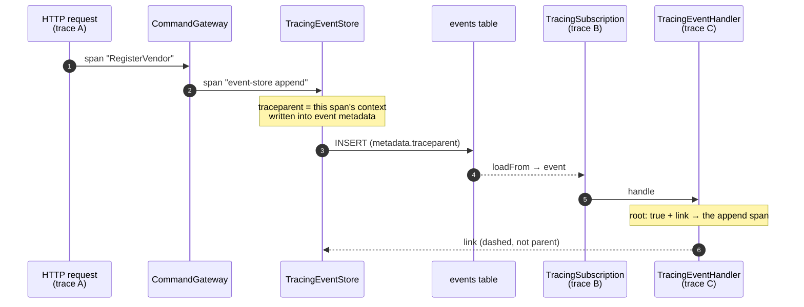

`TracingEventStore` serialises its *own* span context as `00-<traceId>-<spanId>-<flags>`
into metadata; `TracingEventHandler` parses it back with a strict regex and attaches it
as a **link**. A malformed or absent `traceparent` degrades to no link — replay of old
events never resurrects a dead trace.

`processing.lag_ms` = `Date.now() - event.timestamp`, i.e. commit-time to handle-time.
Per ADR 0026 this is the read-model freshness SLO — a signal a CRUD system has no
equivalent of.

### 10.4 The suppression dance

Idle polls are two "is there anything new?" queries. Their auto-instrumented pg/dns/tcp
spans outnumbered every other span in production **~1000:1**, each its own root trace
because the poller runs outside any request context.

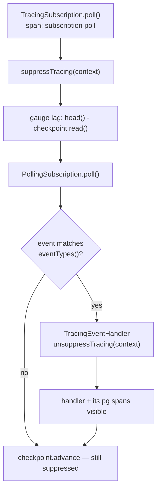

So detail is dropped exactly when nothing happened, and restored the moment there is
real work. The lag gauge is read **before** the poll deliberately — `poll()` drains
before returning, so reading afterwards would always gauge zero. A failure in the gauge
sets `subscription.lag_unavailable` rather than failing the poll: a measurement that
takes down the thing it measures is the worse failure.

### 10.5 Gaps

**Not tracked anywhere — these are new observations.**

1. **`admin-api` has no tracing at all.** No `tracing.ts`, no OTel import, no SDK
   bootstrap. It writes to the same Postgres (`SubdomainRegistry`) and creates Auth0
   users entirely untraced. Every span-based invariant above applies to `apps/api`
   only. This is the largest gap by surface area.

2. **The projection⇄checkpoint transaction is invisible.** `PollingSubscription` wraps
   `handle` + `checkpoint.advance` in `unitOfWork.transaction`, but only the inner
   `handle` un-suppresses. `BEGIN`, `COMMIT` and the checkpoint `UPDATE` produce no
   spans. The mechanism that makes projection writes atomic — the thing most worth
   watching for lock contention — is the one thing you cannot see.

3. **`loadFrom` and `head` are unspanned**, and run under suppression, so their pg
   spans are dropped too. A slow or failing catch-up query surfaces only as a slow
   `subscription poll` span with no detail. Deliberate (it is what §10.4 buys) but the
   cost is real: the most-executed store operation in the system is opaque.

4. **`Subscriptions.rebuild()` emits no span of its own.** A rebuild clears a read
   model and replays the entire log — the single most impactful operation available,
   and the one behind GDPR erasure. Nothing records that a rebuild happened, which
   projection, how long `reset()` took, or how many events were replayed. Given the
   documented read-availability window during a rebuild ([`DEFERRED.md`](DEFERRED.md)
   § Scoped projection reset), this is worth a span.

5. **`VendorErasure.erase()` emits no span.** Three steps — shred, rebuild, remove
   subdomain — on a compliance-critical path, with no trace tying them together. A
   partial failure has to be reconstructed from pg spans.

6. **`event-store load` has no error path.** Alone among the application spans it wraps
   its work in `try`/`finally` with no `catch`, so a failing rehydration produces a span
   that looks successful — no `exception.slug`, no recorded exception, no ERROR status.
   Any "which store operations are failing?" query silently excludes reads.

7. **`exception.slug` is an unenforced convention.** Five slugs, five string literals,
   no shared constant and no lint rule. A sixth spelled differently would silently
   escape any Honeycomb query built on the field.

8. **`DomainErrorFilter` annotates nothing.** It converts a `DomainError` into a 400
   without touching the active span. In practice the dispatch span already recorded the
   exception on the way out, so this is minor — but the filter is the last place that
   knows the error became a *client* error rather than a server fault, and it drops
   that distinction.

9. **No metrics pipeline.** The exporter is `exporter-trace-otlp-proto` — traces only.
   `subscription.lag` and `processing.lag_ms` are span attributes, so every SLO is a
   query over spans. Any true counter or gauge needs a new pipeline.

10. **No sampling.** No `OTEL_TRACES_SAMPLER` is set in `render.yaml` or anywhere else,
    so `NodeSDK` falls back to `ParentBased(AlwaysOn)` and 100% of spans are exported to
    Honeycomb. Fine at current volume; a cost cliff later.

**Already tracked in [`O11Y-PLAN.md`](O11Y-PLAN.md)** — not repeated here beyond the
pointer: per-type payload attribute extractors (step 4, value-gated); stuck-subscription
alerting (step 5, evidence-gated, with a ready design); OTel Collector and tail-based
sampling (deferred per ADR 0026).

### 10.6 Testing spans

`apps/api/src/app/testing/span-capture.ts` registers a hermetic test-only
`NodeTracerProvider` + `InMemorySpanExporter` + `SimpleSpanProcessor`, once per process,
with no auto-instrumentation — so `getFinishedSpans()` contains only application spans.
Mechanism is tested synthetically at the decorator level; real-domain social tests are
reserved for spans handed content-bearing messages, where an exact-match assertion is a
genuine PII guard.

---

## 11. Testing strategy

- **Contract suites** (`test/src/**/*.contract.ts`) — one suite, run against both the
  in-memory and Postgres adapters, so the fake and the real thing cannot drift. Eight of
  them: `eventStoreContract`, `eventsContract`, `checkpointContract`,
  `subscriptionContract`, `dataKeysContract` over the ports, plus
  `catalogueViewsContract`, `marketScheduleViewsContract` and
  `vendorStorefrontViewsContract` over the read models.
- **Container specs** (`*.container.spec.ts`) — real Postgres via testcontainers, run
  from a separate vitest config (`test:container`), excluded from the fast suite.
- **API specs** (`apps/api/**/*.spec.ts`) — full Nest app over supertest on the
  in-memory profile, with `POLLING_ENABLED` overridden to `false` and
  `Subscriptions.drain()` driving delivery deterministically.

`drain()` runs N rounds where N is the consumer count, so a processor's events reach
downstream projections within one call.

---

## 12. File map

| Concern | Path |
|---|---|
| Ports | `packages/event-sourcing/src/ports/` |
| Domain primitives | `packages/event-sourcing/src/domain/` |
| Adapters | `packages/event-sourcing/src/adapters/{in-memory,postgres}/` |
| Cross-cutting stores | `packages/event-sourcing/src/adapters/{lineage,shredding}.event-store.ts` |
| Aggregates + repositories | `packages/market-days/src/<aggregate>/` |
| Projections + read models | `packages/market-days/src/<name>-view/` |
| Composition root | `apps/api/src/app/app.module.ts` |
| Profiles | `apps/api/src/app/persistence/` |
| Subscription runner | `apps/api/src/app/event-sourcing/subscriptions.ts` |
| Tracing decorators | `apps/api/src/app/event-sourcing/tracing/` |
| OTel bootstrap | `apps/api/src/tracing.ts` |

### Related ADRs

0002 (event sourcing + CQRS) · 0005 (single events table) · 0009 (stream-per-aggregate)
· 0010 (repositories) · 0014 (payload vs metadata) · 0015 (polling subscriptions,
amended) · 0016 (read-model port segregation) · 0025 (crypto-shredding) · 0026
(observability) · 0028 (serialised appends) · 0029 (Postgres adapters) · 0030
(LISTEN/NOTIFY)
